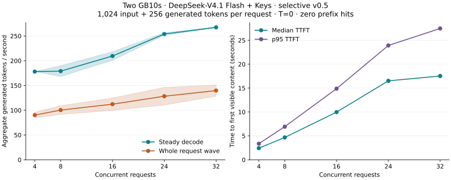

# DeepSeek-V4.1-Flash · 2× GB10 · TensorFold

**Keys abliteration · Vision · Strict JSON and tools · A large shared KV pool**

Run DeepSeek-V4.1-Flash across two NVIDIA GB10s with Mia's EXL3 weights, drowzeys' Keys overlay and a TensorFold TP2 engine built on Bertholomus's work. This fork combines measured concurrency and memory improvements with a reversible deployment workflow.

| Headline | Measured result |
|---|---|
| Shared KV pool | **8,650,752 logical tokens** across **32 active slots** |
| Maximum context | **1,048,576 tokens per request**, prompt plus reply |
| C1 code / prose / counting decode | **94.5 / 59.0 / 137.8 output tok/s** |
| Cold 32K / 128K prefill | **2,000 / 1,837 input tok/s**, measured as input/TTFT |
| C16 / C32 steady decode | **209.9 / 272.2 aggregate output tok/s** |
| Model features | **Vision, Keys abliteration and strict structured output** enabled together |

Measured on the FP32-corrected two-GB10 build on 2026-10-08 using fully verified existing model and prepared-cache assets, with the optional reasoning-loop guard off. C1 and prefill use the unchanged upstream benchmark client; C16/C32 use the local suite. [Workloads and timing boundaries](#benchmarks) matter when comparing these numbers. Active and retained sessions share the pool; 32 slots do not mean 32 simultaneously full million-token histories.

[Credits](#credits) · [Setup](#setup) · [Rollback](#rollback) · [Benchmarks](#benchmarks) · [License](#license)

## Author's anecdote

I have personally been using this with model aliases suffixed with `-1m` and `-262k` (variants differing only in context window) configured in my coding agent: `-1m` interactively and `-262k` for 32 parallel sessions, and I've been seeing ~140 aggregate tok/s for long-running code review/refactor agent sessions. As far as I know, this is the only dual GB10 recipe for this model that supports this (C32 at full 262k) as of today, 2026-10-08.

## Credits

This work builds on the following projects and contributors:

| Contributor | Contribution |
|---|---|
| [ashhart / TensorFold contributors](https://github.com/ashhart/TensorFold) | TensorFold framework, EXL3 foundation and inherited kernels |
| [Bertholomus / Albert Lee](https://github.com/bertholomus/TensorFold/tree/deepseek-v41-tp2) | DeepSeek TP2 engine, vision/RDMA integration, benchmark kit, v0.5 kernel/memory improvements and v0.5.1 FP32/loop-guard fixes |
| [Capicua25x](https://github.com/bertholomus/deepseek-v4.1-tensorfold-tp2-2xgb10/pull/9) | Novelty signal used by Bertholomus's optional reasoning-loop guard |
| [Mia-AiLab](https://huggingface.co/Mia-AiLab/DeepSeek-V4.1-Flash-EXL3-2.9bpw) | EXL3 2.9-bpw checkpoint |
| [drowzeys / Keys](https://huggingface.co/drowzeys/DeepSeek-V4.1-Flash-Abliterated-Cybersecurity-Unleashed) | Matching Keys attention overlay |
| [DeepSeek](https://huggingface.co/deepseek-ai/DeepSeek-V4.1-Flash) | Original model, assets and model research |
| [Urtho](https://github.com/urtho/TensorFold) | Adapted structured-output/DRM work and approaches to graph and memory budgeting |
| [Jay Leaton](https://github.com/jayleaton/deepseek-v41-tensorfold-spark) | Parsing/grammar work adapted through Urtho, with its MIT notice retained |
| [coolbho3k / Emi Huang](https://github.com/coolbho3k/DeepSeek-v4.1-Flash-2x-DGX-Spark) | vLLM recipe reference and the display-memory idea credited by Urtho's independent DRM implementation |
| Soumyarup Sarkar | Local integration, sampling controls, capacity/retention policies, diagnostics, measured draft policy, reversible deployment tools and publication preparation |

Performance results describe the combined system. [Detailed attribution and source pins](deployment/COMPARISON.md#attribution), [family provenance](tools/dsv41/ATTRIBUTION.md) and [third-party notices](THIRD_PARTY_NOTICES.md) identify adapted code and its origins.

## Setup

Run the controller from this repository on the **head node**; it manages the worker over SSH. The verified asset-reuse path has completed paired hardware qualification; fresh acquisition still needs that end-to-end check. The [full installation runbook](deployment/README.md) covers both paths, asset recovery and build details.

### Prerequisites

| Requirement | What to prepare |
|---|---|
| Machines | Two NVIDIA GB10 systems running a compatible Linux/systemd environment; both otherwise idle for installation and startup |
| GPU/container support | Compatible NVIDIA drivers and Docker with NVIDIA GPU support on both nodes |
| Host tools | Python **3.12+**, rsync, SSH, sudo, `ip`, `ibv_devinfo`, `nvidia-smi` and systemd/module tools on both nodes; Git on the head |
| RoCE network | Two working rails, stable IPv4 addresses, Ethernet **MTU 9000** and active RDMA **MTU 4096**; use the actual device names and addresses for your pair |
| SSH and privileges | Verified worker host key, passwordless SSH from head to worker, and noninteractive sudo for the controller's Docker, host-probe and temporary display/module operations |
| Available memory | At least **112 GiB `MemAvailable` per node** before model loading; this profile temporarily takes over the NVIDIA display |
| Storage | Roughly **724 GB on the head / 520 GB on the worker**, plus container images, logs and free-space margin; decimal GB, including the observed prepared caches |
| Model access | Access to the [pinned Hugging Face assets](deployment/config/assets.json); a read-only HF token in an external file if authentication is required |

Use dedicated empty data directories writable by the SSH user on each machine. They must not be shared with another installation or redirected through symlinks. The storage estimate includes stock weights, Keys, extracted Engram files and prepared caches; the head also retains the original Engram shards. [Storage details](deployment/README.md#acquire-and-verify-assets).

The recipe uses containerized inference dependencies, including NCCL. It does not install host CUDA development packages or host NCCL. Prepare drivers, Docker, SSH and persistent network settings before capturing the baseline. Those prerequisite changes are outside this recipe's rollback scope. Routine recipe start/stop requires no reboot once prerequisites are in place.

### 1. Configure the pair and capture its baseline

Place a clean Git checkout on the head, then enter its directory:

```bash
cd deepseek-v4.1-flash-2X-GB10-TensorFold
cp deployment/config/cluster.example.json deployment/local.json
```

Edit `deployment/local.json` **before running `init`**:

| Setting | Choose for this installation |
|---|---|
| `worker.ssh` | The worker's `user@host`, reachable through your verified SSH configuration |
| `head.data_root`, `worker.data_root` | Dedicated writable absolute paths; the `/srv` example is not automatically made writable |
| Each node's `rails` | Both HCA names, network interfaces and already configured IPv4 addresses |
| `api.bind`, `api.port`, `master_port` | The listening address and unused ports; defaults are loopback port 8000 and rendezvous port 29581 |
| `allow_temporary_drm` | Set to **`true`** after reviewing [rollback](#rollback); startup temporarily stops the display manager and changes current-boot DRM settings |
| `api.allow_unauthenticated_lan` | Keep `false` for loopback, or explicitly set `true` when choosing a LAN bind |

For open access on a trusted LAN, set `api.bind` to the head's LAN address or `0.0.0.0` and set `api.allow_unauthenticated_lan=true`. The API has no authentication. [Security and access boundaries](SECURITY.md).

Run these in order, proceeding only after each succeeds:

```bash
python3 cluster plan
python3 cluster doctor
python3 cluster init
```

`plan` renders configuration without host actions. `doctor` reads host/network state. `init` assigns an installation UUID, creates owned data directories, saves the configuration and captures both hosts' baselines. Existing nonempty directories are refused. Configuration changes after initialization are rejected to keep recovery tied to the original pair.

The private settings and journals live in Git-ignored `deployment/local.json` and `deployment/.local/`. Preserve them for the lifetime of the installation.

### 2. Download, prepare and verify the weights

If authentication is needed, point `HF_TOKEN_PATH` at an existing file outside this checkout containing your token. This prompts for the **file path**, not the token:

```bash
read -r -p 'Path to your HF token file: ' HF_TOKEN_PATH
export HF_TOKEN_PATH
```

Then run:

```bash
python3 cluster fetch
python3 cluster replicate
python3 cluster verify
```

`fetch` downloads immutable asset revisions, prepares the Engram and vision assets, and creates a separate model view with the 104 verified Keys tensor overrides. `replicate` copies serving assets to the worker without deleting existing files. `verify` performs full hash checks on both nodes. The token is used for acquisition and is not included in the image or serving containers.

Original stock assets remain available. Downloads can resume through their range journals; a failed extraction may need its incomplete `.prepare-part` output reviewed before retrying. See [asset recovery](deployment/README.md#acquire-and-verify-assets).

### 3. Build and start both ranks

Keep the tracked checkout clean and committed; the local configuration and journals are ignored by Git.

```bash
python3 cluster build
python3 cluster precompile
python3 cluster start
python3 cluster status
```

`build` uses the pinned NVIDIA base and committed source, transfers the same image to the worker and checks image identity. `precompile` compiles the serving extensions on both nodes with weights unloaded. `start` verifies assets, rails, memory and ports, journals the display changes, then starts worker and head with a transient paired monitor. The monitor stops both ranks on repeated health/memory failures or stalled progress; it does not automatically restart a poisoned runtime.

The model name is `DeepSeek-V4.1-Flash-Keys`. The default API is `http://127.0.0.1:8000/v1`; use your configured address and port if you changed the bind. No inference service is enabled at boot.

### 4. Send a request

With the default loopback bind:

```bash
curl --fail http://127.0.0.1:8000/v1/chat/completions \
  -H 'Content-Type: application/json' \
  -d '{"model":"DeepSeek-V4.1-Flash-Keys","messages":[{"role":"user","content":"What is 12 times 13?"}],"max_tokens":64}'
```

The maximum context includes both prompt and reply. Clients can choose smaller budgets within the server's 1,048,576-token ceiling. See [sampling behavior](deployment/SAMPLING.md) for random seeds, prompt-derived seeds and explicit replay.

## Rollback

Rollback restores the recipe-managed host state captured for this installation. It preserves downloaded assets, prepared/kernel caches, source and images so that the installation can be started again.

### Normal stop and restoration

Run from the same checkout on the head:

```bash
python3 cluster stop
python3 cluster check-host
```

`stop` removes this installation's owned rank containers and transient monitor, saves logs and attempts restoration of the captured display/module state. `check-host` compares driver/kernel, display/module settings and the configured rail addresses/MTUs with the baseline. A difference is reported for review rather than overwritten automatically.

Keep **all of `deployment/.local/` until restoration succeeds**. Git does not back up this ignored recovery state. Host packages, credentials and network settings installed as prerequisites are not undone by these commands.

### Interrupted setup, reboot or changed configuration

If the local configuration was edited, use the saved original configuration:

```bash
python3 cluster --config deployment/.local/installed.json stop
python3 cluster --config deployment/.local/installed.json check-host
```

If a worker is unreachable, bring it back and retry with the same journals. A failed restoration retains its journal for review. After a reboot, the tool compares state but does not impose stale current-boot settings. Do not erase journals or edit ownership records to bypass a failure.

Before updating source, stop and verify restoration, then preserve the source commit, local configuration/state, image ID, precompile receipt and owned assets. If an update fails, use that update's intact journals to restore the hosts before returning to the preserved version. Keep this checkout at the same path while an installation is active; its monitor records that path.

Removing retained data or image tags is a separate, optional step after restoration. Confirm the installation UUID and shared references first. [Full rollback and removal runbook](deployment/ROLLBACK.md).

## What this fork adds

- Selective Bertholomus v0.5 improvements: compact prompt histories and RoPE tables, reduced indexer/attention work and grouped-expert prefill. The framework remains based on TensorFold 0.6.3; this is not a full 0.6.6 merge.
- Bertholomus v0.5.1 FP32 correction with a startup arithmetic check, plus an optional reasoning-loop guard. The guard is off by default and can be enabled per request; [behavior and qualification](deployment/UPSTREAM-V051.md).
- Bertholomus's replay-floor correction, preventing short replay chunks from attending to a previous request's stale keys. [October 9 review and integration](deployment/UPSTREAM-V06.md) records this selective port and the deferred Zig migration.
- Temporary DRM allocation, bounded graph/scratch memory, admission diagnostics and up to 32 retained prefixes with two recent checkpoints each. Pool tensors consume 7.49 GiB per rank in the measured configuration.
- The Keys overlay, image input, strict structured output and configurable random or prompt-derived request seeds. The recipe selects random seeds; explicit request seeds still work.
- A measured draft-cost policy, shared round outputs and bounded 8K/262K/1M graph widths. The selected 32-row target budget uses ordinary decoding at C17–32 and resumes drafting as concurrency falls. Experimental 64-row profiles are outside this portable candidate.
- Installation ownership, pinned asset acquisition, verified immutable asset reuse, paired failure handling and journaled host restoration, with offline contract tests, CI and paired hardware evidence.

Session KV writes to NVMe are off. Prepared weights, compiled kernels and logs still write to disk. [v0.5 integration decisions](deployment/UPSTREAM-V05.md), [v0.5.1 correctness update](deployment/UPSTREAM-V051.md), [portable cutover qualification](deployment/CUTOVER.md) and [historical qualification](benchmarks/QUALIFICATION.md) describe the selected engine and its limits.

## Benchmarks

Matched methods on the same two GB10s, with Mia 2.9-bpw + Keys, 1K prefill chunks, 32 slots and the shared pool above. Both builds reused verified assets. The earlier container inherited the TF32 override; the current build enforces FP32 arithmetic. Both measurements are from 2026-10-08 UTC.

| Workload | Previous TF32 build | FP32 update | Measurement |
|---|---:|---:|---|
| C1 code / prose / counting decode | 93.9 / 58.2 / 136.7 | **94.5 / 59.0 / 137.8** | Output tok/s; unchanged upstream client, set-b, T=0, 384-token maximum, medians of 3 |
| Cold 32K / 128K input throughput | 2,021 / 1,852 | **2,000 / 1,837** | Input tok/s through first-content latency; upstream client, medians of 3 |
| C16 / C32 steady decode | 214.5 / 266.9 | **209.9 / 272.2** | Aggregate output tok/s; local suite, distinct 1K prompts, 256 forced outputs, medians of 2 |
| C16 / C32 whole cold wave | 108.6 / 133.0 | **117.2 / 145.5** | Same suite, including admission and prefill |
| Large-session capacity | 32 × 262,144, twice | **32 × 262,144, twice** | Identical primed document, independent active session states; not 32 cold independent document prefills |
| Native-million retrieval | 1,048,576 | **1,048,576** | Total prompt + reply tokens, cold input, all three passphrases recovered |
| Vision / Keys / strict output | Passed together | **Passed together** | Constrained requests use ordinary decoding |

After the arithmetic correction, **76/178** local replies retained the previous build's token and text hashes. All **89/89** repeated fixed-input pairs matched within the updated build. Each local suite generated 46,336 scored output tokens. These timings compare complete builds, including changed reply trajectories; all repetitions and ranges are retained. The historical upstream C4 burst/sustained results (120.9 / 133.0 aggregate tok/s) were not repeated here.

The configured pool budget differs from populated history. The updated large-session test sampled 8,388,192 populated logical tokens; retained prefixes share the pool, and contiguous-allocation requirements can queue requests before every slot fills. The counting benchmark is not a strict-JSON benchmark. Feature qualification does not establish the overlay's quality across all tasks.

[Methods, ranges and reproduction](benchmarks/README.md) · [FP32 update qualification](deployment/UPSTREAM-V051.md) · [Historical cutover](deployment/CUTOVER.md) · [Comparison with Bertholomus, Urtho and coolbho3k](deployment/COMPARISON.md).



## Development and release status

Keep development and the pinned serving checkout separate. The
[cutover and update workflow](deployment/WORKFLOW.md) covers source/image pins,
private state, qualification and restoration.

Run the offline checks without downloading weights or contacting either host:

```bash
python3 -B -m unittest discover -s tests/publication -v
python3 -B scripts/check_release.py
python3 -B cluster --config deployment/config/cluster.example.json plan
```

The engine source is fingerprinted against the qualified snapshot. The verified-reuse cutover has hardware evidence; fresh acquisition, an actual reboot-recovery exercise and final licensing review remain release work. [Historical preparation checks](release/preparation-checks.json) · [Release status](release/STATUS.md) · [Contributing](CONTRIBUTING.md) · [Security](SECURITY.md).

The inherited TensorFold families and backends remain in the source tree. This recipe covers the DeepSeek-V4.1 CUDA TP2 configuration described above. Consult [upstream TensorFold](https://github.com/ashhart/TensorFold) for its other configurations.

## License

The project's Apache-2.0 license and retained MIT/third-party notices are documented in [LICENSE](LICENSE), [NOTICE](NOTICE), [THIRD_PARTY_NOTICES.md](THIRD_PARTY_NOTICES.md) and [family attribution](tools/dsv41/ATTRIBUTION.md).

Model weights, overlays and the NVIDIA container base have their own terms. This repository distributes source and asset references; weights and container images are acquired separately.
